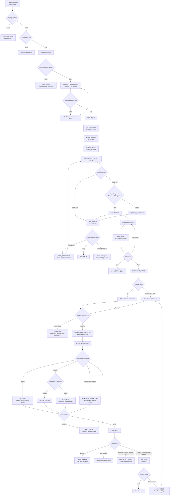

# Kontrol Envanteri → Bulgu Takip Manuel Test Checklisti

Bu doküman, bir **Ana Kontrolün** envantere alınmasından **Bulgu Takip Çalışmasının** onaylanmasına ve Bulgunun kapanmasına/yeniden açılmasına kadar uygulamadaki uçtan uca dalları manuel test etmek için hazırlanmıştır.

## 1. Kanonik akış şeması



## 2. Test rolleri ve temel veri

Her senaryoda tarayıcı geliştirici araçlarından başarısız isteğin HTTP durumunu da kontrol edin.

| Rol | Örnek kullanıcı | Temel kullanım |
|---|---|---|
| Sistem yöneticisi | `burak@rmic.com` | Yönetim, atama, kontrollü iptal/yeniden açma |
| Risk ve Kontrol Yöneticisi | `mgr1@rmic.com`, `mgr2@rmic.com` | Planlama, ikinci kontrol, mutabakat onayı |
| Denetçi/Kontrolcü | `aud1@rmic.com`, `aud2@rmic.com` | Kontrol testi, bulgu ve değerlendirme |
| Denetlenen birim | `birim@rmic.com` | Yalnız kendi aksiyonunu görüntüleme/güncelleme/tamamlama |
| Salt görüntüleyici | Ayrı VIEWER kullanıcı | Yazma düğmelerini görmemeli, API yazmaları 403 olmalı |

Önerilen başlangıç verisi:

- [ ] İki aktif kontrolcü ve iki farklı ikinci kontrolcü hazır.
- [ ] Bir aktif, bir pasif Ana Kontrol hazır.
- [ ] Bir aylık, bir üç aylık, bir yıllık ve bir günlük kontrol hazır.
- [ ] Test yılı olarak içinde bulunulan yıl seçildi.
- [ ] Tarayıcıda iki ayrı kullanıcı oturumu açılabiliyor.
- [ ] Her senaryoda oluşturulan Kontrol/Bulgu/Aksiyon/Takip numarası not ediliyor.

## 3. Kontrol Envanteri

### KE-01 — Geçerli Ana Kontrol oluşturma

- [ ] Kontrol Envanteri → Yeni Kontrol ekranını aç.
- [ ] Kod, ad, açıklama, tip, nitelik, otomasyon, periyodiklik, direktörlük ve test adımlarını doldur.
- [ ] Kaydet ve envantere dön.
- [ ] Beklenen: Kayıt listede tek kez görünür; detay ekranındaki alanlar girişle aynıdır.
- [ ] Beklenen: Denetim izinde `CREATE / Control` kaydı oluşur.

### KE-02 — Zorunlu alan ve sınır kontrolleri

- [ ] Kontrol kodunu/adını boş bırakıp kaydetmeyi dene.
- [ ] 500 karakterden uzun ad ve 10.000 karakterden uzun açıklama dene.
- [ ] Geçersiz direktörlük veya değiştirilmiş request payload ile kayıt dene.
- [ ] Beklenen: Okunabilir Türkçe doğrulama hatası; 500 hatası ve kısmi kayıt yok.

### KE-03 — Çift gönderim

- [ ] Kaydet düğmesine hızlıca iki kez bas.
- [ ] Beklenen: Tek Ana Kontrol oluşur; iki farklı kontrol numarası oluşmaz.

### KE-04 — Yıllık plandan türetilen aktif/pasif durumu

- [ ] Yeni Kontrol ve Kontrol Düzenle ekranlarında Due Date alanının bulunmadığını doğrula.
- [ ] Durumun seçim alanı olmadığını ve bu ekranlardan değiştirilemediğini doğrula.
- [ ] Mevcut yılın Yıllık Planında bulunmayan kontrolü aç.
- [ ] Beklenen: Envanter, detay ve düzenleme ekranlarında `Pasif` görünür.
- [ ] Kontrolü mevcut yılın Yıllık Plan kapsamına al ve kontrolün aktif kapsamda olduğunu doğrula.
- [ ] Beklenen: Envanter, detay ve düzenleme ekranlarında `Aktif` görünür.
- [ ] Kontrolü yalnızca başka bir yılın planına al.
- [ ] Beklenen: Mevcut yıl kapsamında olmadığı için `Pasif` görünmeye devam eder.
- [ ] Kontrolü mevcut yılın kapsamından çıkar veya mevcut yıl kapsamını pasife al.
- [ ] Beklenen: Durum yeniden `Pasif` olur; formdan ayrıca durum güncellemesi gerekmez.

### KE-05 — Sürüm ve donmuş kapsam

- [ ] Kontrolü bir yıllık plana uygula.
- [ ] Sonra Ana Kontrol tanımını/test adımlarını değiştir.
- [ ] Beklenen: Ana Kontrol sürümü artar; uygulanmış Dönem Kontrolünün eski snapshot'ı kendiliğinden değişmez.
- [ ] Yeni sürümü döneme uygulama akışını çalıştır.
- [ ] Beklenen: Devam eden görev varsa açık onay/karar ister; sessizce ezmez.

## 4. Yıllık Plan

### YP-01 — Taslak ve önizleme

- [ ] Aktif kontrolü yıl kapsamına al.
- [ ] Kontrolcü, ikinci kontrolcü, periyodiklik ve referans ayı seç.
- [ ] Taslağı kaydet, sayfayı yenile.
- [ ] Beklenen: Taslak seçimleri korunur; henüz Dönem Kontrolü ve görev oluşmaz.
- [ ] Önizleme aç.
- [ ] Beklenen: Oluşacak/değişecek/kapsam dışı kalacak görevler açıkça gösterilir.

### YP-02 — Atama kuralları

- [ ] Aynı kullanıcıyı kontrolcü ve ikinci kontrolcü seç.
- [ ] Pasif veya yetkisiz kullanıcıyı ikinci kontrolcü seçmeye çalış.
- [ ] Beklenen: Uygulama engeller; plan uygulanmaz.
- [ ] İki farklı, aktif ve yetkili kullanıcı seç.
- [ ] Beklenen: Önizleme geçerli olur.

### YP-03 — Planı uygulama

- [ ] Geçerli önizlemeyi uygula.
- [ ] Beklenen: Bir Dönem Kontrolü ve periyoda uygun görevler oluşur.
- [ ] Aynı planı değişiklik yapmadan tekrar uygula.
- [ ] Beklenen: Mükerrer Dönem Kontrolü/görev oluşmaz.

### YP-04 — Periyodiklik dalları

- [ ] `MONTHLY`: 12 aylık görev dağılımını kontrol et.
- [ ] `QUARTERLY`: referans ayına göre dört görev oluştuğunu kontrol et.
- [ ] `SEMI_ANNUAL`: referans ayına göre iki görev oluştuğunu kontrol et.
- [ ] `ANNUAL`: seçilen ayda tek görev oluştuğunu kontrol et.
- [ ] `WEEKLY`: yılın haftalık görevlerini kontrol et.
- [ ] `DAILY`: otomatik görev oluşmadığını doğrula; bu bilinçli mevcut davranıştır.
- [ ] Ay sonu hafta sonuna geliyorsa son iş gününe çekildiğini kontrol et.

### YP-05 — Uygulanmış planı değiştirme

- [ ] Periyodiklik/referans ayı değiştir.
- [ ] Beklenen: Bekleyen görevler diff ile düzenlenir; tamamlanmış/onaylı görevler korunur.
- [ ] Devam eden görev için atama değiştir.
- [ ] Beklenen: `KEEP/CANCEL` benzeri açık karar olmadan uygulama engellenir.
- [ ] Kapsamdan çıkar.
- [ ] Beklenen: Görev silinmez, `KAPSAM_DISI` olur.
- [ ] Tekrar kapsama al.
- [ ] Beklenen: Aynı kapsam kaydı/görev uygun biçimde yeniden etkinleşir.

### YP-06 — Eşzamanlılık ve yıl izolasyonu

- [ ] Önizleme aldıktan sonra başka oturumdan taslağı değiştir; eski önizlemeyi uygula.
- [ ] Beklenen: 409/çakışma; eski veri uygulanmaz.
- [ ] 2027 planını değiştir.
- [ ] Beklenen: 2026 kapsam ve görevleri değişmez.

## 5. Dönem Kontrolü ve Kontrol Testi

### DK-01 — Liste/detay bütünlüğü

- [ ] Dönem Kontrolleri listesinden kapsam detayına gir.
- [ ] Beklenen: Ana Kontrol, yıl, kapsam kodu, periyot, kontrolcüler ve görev sayıları yıllık planla aynıdır.
- [ ] Ana Kontrol ve Dönem Kontrolü bağlantılarını yeni sekmede aç.
- [ ] Beklenen: Doğru kayıtlara gider.

### KT-01 — Görevi başlatma ve taslak koruma

- [ ] Atanmış kontrolcüyle `BEKLIYOR` görevi başlat.
- [ ] Beklenen: `DEVAM_EDIYOR` olur.
- [ ] Test adımı gözlemi, genel değerlendirme ve kanıt özeti gir.
- [ ] Sayfadan çıkıp tekrar aç.
- [ ] Beklenen: Otomatik kaydedilen bütün metinler korunur.
- [ ] Kaydetme sürerken Bulgu Kaydı Oluştur'a bas.
- [ ] Beklenen: Önce test taslağı kaydedilir; bulgu sonrası gözlemler silinmez.

### KT-02 — Kanıt yükleme

- [ ] Geçerli PDF/DOCX/XLSX/PNG/JPEG yükle.
- [ ] Beklenen: Dosya görünür ve tekrar açılabilir.
- [ ] Boş, 15 MB üstü, izin verilmeyen uzantı veya MIME/uzantı uyumsuz dosya dene.
- [ ] Beklenen: Yükleme reddedilir, okunabilir hata gösterilir.
- [ ] Aynı dosyayı iki kez yükle.
- [ ] Beklenen: İki ayrı ek kaydı oluşur; önceki dosyanın üzerine yazılmaz.

### KT-03A — Bulgu yok dalı

- [ ] `Bulgu Yok` seç ve testi tamamla.
- [ ] Beklenen: Test `TAMAMLANDI`, onay bekliyor; henüz `ONAYLANDI` değildir.
- [ ] Atanmış ikinci kontrolcüyle onayla.
- [ ] Beklenen: `ONAYLANDI`; kontrol etkinlik özeti `EFFECTIVE` yönünde güncellenir.

### KT-03B — Bulgu var/yeni bulgu dalı

- [ ] `Bulgu Var` seç; bulgu oluşturmadan testi tamamlamayı dene.
- [ ] Beklenen: “Önce bulgu oluşturun/referanslayın” uyarısı; tamamlama yok.
- [ ] Yeni Bulgu oluştur ve teste dön.
- [ ] Beklenen: Bulgu test altında görünür, gözlem alanları korunur.
- [ ] Testi tamamla.
- [ ] Beklenen: `TAMAMLANDI`; bağlı bulgu nedeniyle sonuç `BULGUSU_VAR`.

### KT-03C — Mevcut açık bulguyu referanslama

- [ ] Aynı Ana Kontrole ait açık bulguyu seç, gerekçe yaz ve onaya gönder.
- [ ] Beklenen: Test mevcut bulguya bağlanır.
- [ ] Başka kontrole ait veya kapalı bulguyu referanslamayı dene.
- [ ] Beklenen: Reddedilir; test tamamlanmaz.

### KT-04 — İkinci kontrolcü dalları

- [ ] Testi yapan kullanıcıyla kendi testini onaylamayı dene.
- [ ] Atanmamış yöneticiyle onaylamayı dene.
- [ ] Beklenen: Her ikisi de 403; durum değişmez.
- [ ] Atanmış ikinci kontrolcüyle gerekçeli geri gönder.
- [ ] Beklenen: `GERI_GONDERILDI`; gerekçe görünür.
- [ ] Kontrolcü düzeltip tekrar tamamlasın; ikinci kontrolcü onaylasın.
- [ ] Beklenen: `ONAYLANDI`; kanıt alanları kilitlenir.
- [ ] Sistem yöneticisi final onayı gerekçeyle iptal etsin.
- [ ] Beklenen: Kontrol özeti en yeni geçerli onaylı teste geri döner.

## 6. Bulgu ve Mutabakat

### B-01 — Bulgu taslağı

- [ ] KZ/`CRITICAL` ve KD/`HIGH` önem düzeyleriyle ayrı bulgu oluştur.
- [ ] Beklenen: İkisi de kabul edilir.
- [ ] Yeni kayıtta `MEDIUM/LOW` göndermeyi dene.
- [ ] Beklenen: Reddedilir; eski kayıt varsa yalnız görüntülenebilir.
- [ ] Kontrol testi, kontrol, direktörlük ve risk ilişkilerini doğrula.

### B-02 — Mutabakat mutlu yol

- [ ] `TASLAK` bulguyu Mutabakata Gönder.
- [ ] Beklenen: `MUTABAKATA_GONDERILDI`.
- [ ] Yetkili kullanıcı birim cevabını girip İKS onayına göndersin.
- [ ] Beklenen: `IC_KONTROL_ONAYINA_GONDERILDI`.
- [ ] Farklı bir Risk ve Kontrol Yöneticisi onaylasın.
- [ ] Beklenen: `MUTABAKAT_YAPILDI`; geçmişte üç adım görünür.

### B-03 — Mutabakat negatif dalları

- [ ] VIEWER/denetlenen birim ile workflow yazma düğmelerini kontrol et.
- [ ] Beklenen: Düğmeler görünmez; doğrudan API denemesi 403.
- [ ] İKS onayına gönderen kullanıcıyla aynı mutabakatı onaylamayı dene.
- [ ] Beklenen: Maker/checker kuralı nedeniyle 403.
- [ ] Aşama atlayarak taslaktan doğrudan onay dene.
- [ ] Beklenen: 400; durum değişmez.
- [ ] İKS onayından gerekçeli geri gönder, düzelt ve tekrar gönder.
- [ ] Beklenen: Geçmiş kaybolmadan akış yeniden ilerler.

### B-04 — Bulgu iptali

- [ ] Açık aksiyon ve takip bulunan bulguyu yetkili kullanıcıyla gerekçeli iptal et.
- [ ] Beklenen: Bulgu workflow'u `IPTAL`; açık aksiyon ve takipler `IPTAL`.
- [ ] Beklenen: Kapanmış/onaylı geçmiş kayıtları korunur.
- [ ] İptal bulguya yeni aksiyon/takip eklemeyi dene.
- [ ] Beklenen: 400.

## 7. Aksiyon

### A-01 — Aksiyon oluşturma ve otomatik takip

- [ ] Bulgu oluşturma formunun içinden aksiyon ekle.
- [ ] Bulgu detayından sonradan ikinci aksiyon ekle.
- [ ] Beklenen: Her aksiyon benzersiz `A-YYYY-NNNN` numarası alır.
- [ ] Beklenen: Her aksiyon için aksiyona bağlı takip otomatik oluşur.
- [ ] Beklenen: Bulgunun hedef çözüm tarihi açık aksiyonların en geç terminidir.

### A-02 — Validasyon ve yetki

- [ ] Açıklamasız, sorumlusuz, tarihsiz veya olmayan kullanıcıyla aksiyon oluştur.
- [ ] Beklenen: 400; placeholder/kısmi aksiyon oluşmaz.
- [ ] `birim@rmic.com` kullanıcısına ait olmayan aksiyonu güncelle/tamamla.
- [ ] Beklenen: Düğme yok veya API 403.
- [ ] Kendi aksiyonunu aç.
- [ ] Beklenen: “Aksiyonu Tamamla” görünür.

### A-03 — Termin uzatma

- [ ] Gerekçesiz termin uzatmayı dene.
- [ ] Beklenen: Reddedilir.
- [ ] Geçerli gerekçeyle tarihi uzat.
- [ ] Beklenen: Aksiyon tarihi, açık takip plan tarihi ve Bulgu hedef tarihi birlikte güncellenir.

### A-04 — Aksiyonu tamamlama

- [ ] Aksiyon sahibinin detay ekranından Aksiyonu Tamamla'yı seç.
- [ ] Beklenen: `TAMAMLANDI/COMPLETED`; bu durum nihai kapanış değildir.
- [ ] Beklenen: Bulgu otomatik kapanmaz; takip doğrulaması bekler.
- [ ] Tamamlanmış aksiyona manuel/otomatik takip aç.
- [ ] Beklenen: Aksiyon `DEVAM_EDIYOR` durumuna geri dönmez.

### A-05 — Çoklu aksiyon ve silme

- [ ] İki aksiyon oluştur; terminleri farklı olsun.
- [ ] Geç terminli aksiyonu sil.
- [ ] Beklenen: Bulgu hedef tarihi kalan aksiyonun tarihine döner.
- [ ] Son aksiyonu sil.
- [ ] Beklenen: Hedef tarih temizlenir; geçmiş takip/denetim kayıtları silinmez, aksiyon bağı boşalır.

## 8. Bulgu Takip Çalışması

### BT-01 — Takip formu ve taslak

- [ ] Takip numarasına tıkla.
- [ ] Beklenen: 404 yerine mevcut takip düzenleme penceresi açılır.
- [ ] Birim cevabı, güncel durum, İKS değerlendirmesi ve sonuç notunu kaydet.
- [ ] Yeniden aç.
- [ ] Beklenen: Alanlar korunur.
- [ ] Değerlendiren ve ikinci kontrolcü aynı kişiyse atamayı dene.
- [ ] Beklenen: Reddedilir.

### BT-02A — Yeterli dalı

- [ ] `YETERLI` seç.
- [ ] Beklenen: Kullanıcıdan `KAPATILDI/KISMEN_KAPATILDI` seçmesi istenmez.
- [ ] Kaydet; ikinci kontrolcü henüz onaylamasın.
- [ ] Beklenen: Aksiyon `KAPATILDI` ve Bulgu `CLOSED` olmaz.
- [ ] Atanmış ikinci kontrolcü onaylasın.
- [ ] Tek aksiyon varsa beklenen: Aksiyon `KAPATILDI`, Bulgu `CLOSED/KAPATILDI`, kapanış tarihi dolu.
- [ ] Başka açık aksiyon varsa beklenen: Bulgu `PARTIALLY_CLOSED/KISMEN_KAPATILDI`.

### BT-02B — Yetersiz/devam dalı

- [ ] `YETERSIZ` + `DEVAM_EDIYOR` seç ve kaydet.
- [ ] Beklenen: Bulgu/aksiyon kapanmaz; güncel durum loguna yeni kayıt eklenir.
- [ ] İkinci kontrolcü onaylasın.
- [ ] Beklenen: Aksiyon `YETERSIZ`, bulgu açık.
- [ ] Termin/takip tarihini güncelle ve yeni takip döngüsünü başlat.

### BT-02C — Yetersiz/erteleme dalı

- [ ] `YETERSIZ` + `ERTELENDI` seç; tarih bırakmadan kaydet.
- [ ] Beklenen: Zorunlu tarih uyarısı.
- [ ] Geçmiş tarih gir.
- [ ] Beklenen: “gelecekte olmalıdır” hatası.
- [ ] Gelecek tarih gir ve kaydet.
- [ ] Beklenen: Bulgu `ERTELENDI`, test/takip tarihi yeni tarihe güncellenir, kapanmaz.

### BT-02D — Yeni aksiyon gerekli dalı

- [ ] `YENI_AKSIYON_GEREKLI` seç.
- [ ] Açıklama, sorumlu veya termin alanlarından birini boş bırak.
- [ ] Beklenen: Kayıt engellenir.
- [ ] Alanları doldurup değerlendirmeyi gönder; ikinci kontrolcü onaylasın.
- [ ] Beklenen: Yeni benzersiz aksiyon ve ona bağlı takip oluşur; Bulgu açık kalır.

### BT-03 — İkinci kontrolcü onay/ret dalları

- [ ] Değerlendiren kendi kaydını onaylamayı denesin.
- [ ] Atanmamış yönetici/admin onaylamayı denesin.
- [ ] Beklenen: 403; yan etki yok.
- [ ] Atanmış ikinci kontrolcü gerekçeli reddetsin.
- [ ] Beklenen: `REDDEDILDI/DEVAM_EDIYOR`; aksiyon ve bulgu durumu değişmez.
- [ ] Değerlendiren düzeltip tekrar göndersin.
- [ ] Beklenen: Onay durumu yeniden beklemeye döner; atanmış ikinci kontrolcü onaylayabilir.
- [ ] Aynı onay isteğini iki kez gönder.
- [ ] Beklenen: İkinci istek idempotent; ikinci aksiyon/kapanış/log yan etkisi oluşmaz.

## 9. Bulgu kapanışı ve yeniden açma

### K-01 — Kapanış kuralları

- [ ] Aksiyonsuz bulguyu kapatmayı dene.
- [ ] Açık/Yetersiz aksiyonlu bulguyu kapatmayı dene.
- [ ] Yalnız `TAMAMLANDI` aksiyonlu bulguyu kapatmayı dene.
- [ ] Beklenen: Üçü de reddedilir; yalnız onaylı `KAPATILDI` aksiyonlar kapanış sayılır.
- [ ] Tüm aksiyon takiplerini `YETERLI` + onayla bitir.
- [ ] Beklenen: Bulgu `CLOSED/KAPATILDI`; açık genel takipler `IPTAL`; kapanış logu oluşur.

### K-02 — Kapalı bulgu koruması

- [ ] Kapalı bulguya yeni aksiyon/takip ekle.
- [ ] Genel bulgu güncellemesinden `CLOSED`, `resolutionStatus` veya `closedDate` gönder.
- [ ] Beklenen: 400; kayıt değişmez.

### K-03 — Yeniden açma

- [ ] Gerekçesiz yeniden açmayı dene.
- [ ] Beklenen: Reddedilir.
- [ ] Yetkili kullanıcıyla gerekçeli yeniden aç.
- [ ] Beklenen: `IN_PROGRESS`, kapanış tarihi temiz; geçmiş kapanış korunur.
- [ ] Yeni aksiyon ekle ve takip zincirini ikinci kez kapat.
- [ ] Beklenen: İkinci kapanış ayrı geçmiş kayıtlarıyla tamamlanır.

## 10. Çapraz kontroller

Her ana senaryonun sonunda:

- [ ] Liste, detay, dashboard ve raporlardaki durumlar aynı.
- [ ] Excel çıktısındaki Bulgu/Aksiyon/Takip sayıları ekran filtresiyle aynı.
- [ ] Envanter ve kontrol detayındaki etkinlik sonucu en yeni **onaylı** teste dayanıyor.
- [ ] İptal/kapalı kayıtlar gecikmiş ve otomatik takip kuyruklarında görünmüyor.
- [ ] Her yazma için Denetim İzinde aktör, işlem, varlık ve zaman bulunuyor.
- [ ] Kullanıcı tarafından gönderilen sahte `userId/evaluatorId/approvedBy` aktör olarak kabul edilmiyor.
- [ ] Yetkisiz kullanıcıda yazma düğmesi görünmüyor; doğrudan API isteği 403 dönüyor.
- [ ] Hata sonrasında sayfa mevcut veriyi koruyor; kısmi veya mükerrer kayıt oluşmuyor.
- [ ] Türkçe karakterler ve uzun metinler bozulmadan görüntüleniyor.

## 11. Test yürütme kayıt şablonu

Her test için aşağıdaki satırı kopyalayın:

```text
Senaryo ID:
Tarih/Saat:
Test Eden:
Rol/Kullanıcı:
Kullanılan Kayıt No'ları:
Beklenen Sonuç:
Gerçekleşen Sonuç:
Durum: GEÇTİ / KALDI / BLOKE
HTTP Durumu / Hata Mesajı:
Ekran Görüntüsü veya Kanıt:
Not:
```
